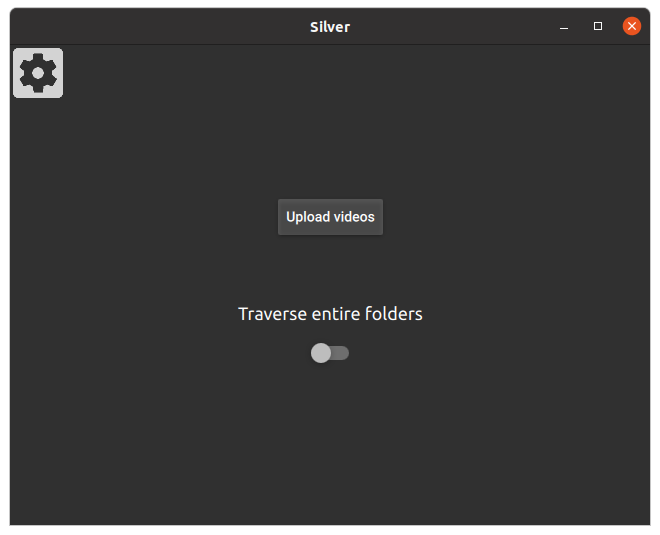
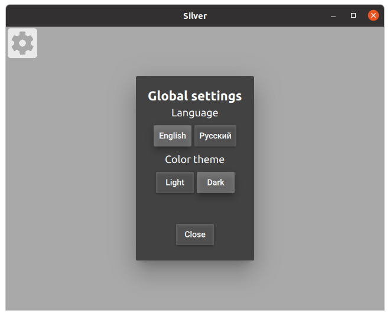
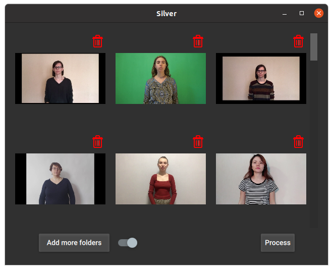
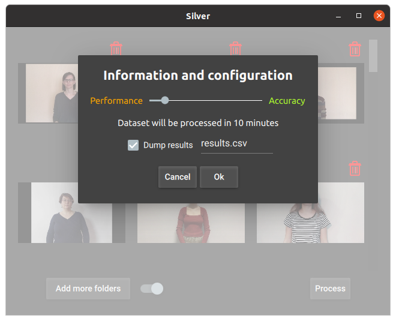
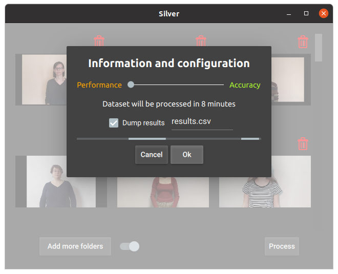

# Silver-qt
Application for Russian Sign Language recognition

### Technologies
+ PyQT5+QML and ONNX models for inference;
+ Material style;
+ Dark/Light color themes
+ Russian/English languages (currently unavailable)

### Installation
```
pip3 install -r requirements.txt
```
Install PyQt5.3+ with additional multimedia part on your own, as usually multimedia does not provided in GPL Qt, eventhough it should be there. On linux (Ubuntu) you can simply install it using package manager, like so:
```
sudo apt install -y qt5-default pyqt5-devlibqt5multimedia5-plugins qml-module-qtmultimedia qml-module-qt-labs-settings libqt5multimedia5-plugins
```
Also, there is added part which checks whether you have multimedia installed, and if not the app will merely have limited functionality
### Instructions
On the first screen you can see settings icon in the top right corner and upload button in the center of the screen. Also there is a switch, which enables automatic traversal of folders, so it will automatically upload all videos in that folder and its subfolders.



When you press on the settings icon, the screen with global settings will appear. You can return to the previous page using close button at the bottom.



After you chose videos, the main screen will be opened. If you have installed multimedia library all videos will be interactive, otherwise there are gonna be just static images. You can click on trash icon to remove particular video. And you cann add more videos using button in the bottom.



Then, when you press process button the processing menu will appear



There you can find compromise between accuracy/performance and choose the file, in which you want to dump predictions. The file is in CSV format. After you press OK button, the progress bar will be shown and the entire app will be blocked. So wait, and try not to kill the application. The prediction of the processing time might be slightly inaccurate.



And, after finishing of the processing, the labels will appear on thumbnails and chosen CSV file will be written


