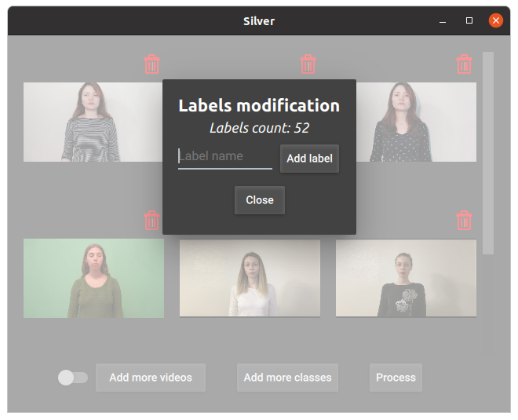
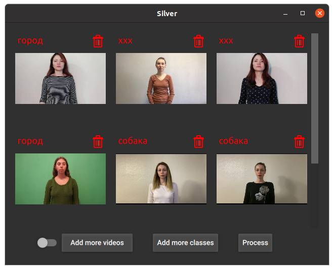

# Silver-qt
Application for Russian Sign Language recognition

### Technologies
+ PyQT5+QML and ONNX models for inference;
+ Material style;
+ Dark/Light color themes
+ Russian/English languages (currently unavailable)

### Installation
```
pip3 install -r requirements.txt
```
Install PyQt5.3+ with additional multimedia part on your own, as usually multimedia does not provided in GPL Qt, eventhough it should be there. On linux (Ubuntu) you can simply install it using package manager, like so:
```
sudo apt install -y qt5-default qml-module-qtmultimedia qml-module-qt-labs-settings libqt5multimedia5-plugins
```
Also, there is added part which checks whether you have multimedia installed, and if not the app will merely have limited functionality. (Ubuntu is recommended to use, as the app have not been tested on other platforms, but you can try to run it on your own risk)
### Instructions
On the first screen you can see settings icon in the top right corner and upload button in the center of the screen. Also there is a switch, which enables automatic traversal of folders, so it will automatically upload all videos in that folder and its subfolders.


When you press on the settings icon, the screen with global settings will appear. You can return to the previous page using close button at the bottom.


After you chose videos, the main screen will be opened. If you have installed multimedia library all videos will be interactive, otherwise there are gonna be just static images. You can click on trash icon to remove particular video. And you can add more videos using button in the bottom.


If you press the "Add label" button, the label addition menu will appear. You can choose any name of the label you want. IMPORTANT: firstly choose the name, and only then press the button. And, in folder dialog which will appear you chould choose the folder, in which all the video files are lying.


After that, the progress bar will appear, and after finish of the processing the number on the top of the popup will increase by one.



Then, in the main menu, when you press process button the processing menu will appear


There you can find compromise between accuracy/performance and choose the file, in which you want to dump predictions. The file is in CSV format. After you press OK button, the progress bar will be shown and the dynamically calculated time will be printed. The most accurate choice will process one video in about one minute. Obviously, it is better to choose higher accuracy, if you want higher accuracy :)


And, after finishing of the processing, the labels will appear on thumbnails and chosen CSV file will be written. The xxx is an artificially added class with index 51. IMPORTANT: if you want to get the best accuracy, do not use label addition, as it could decrease the overall accuracy. We are working on the fast and accurate label addition.


