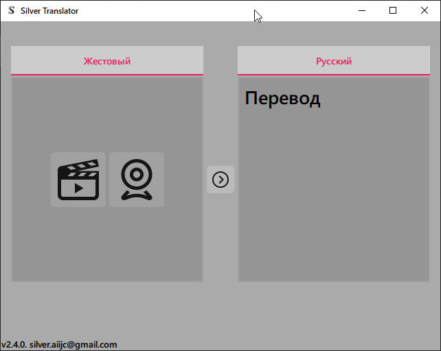
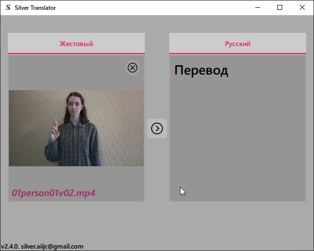
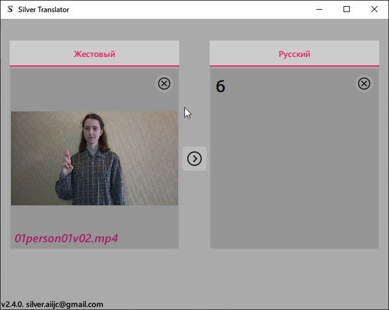
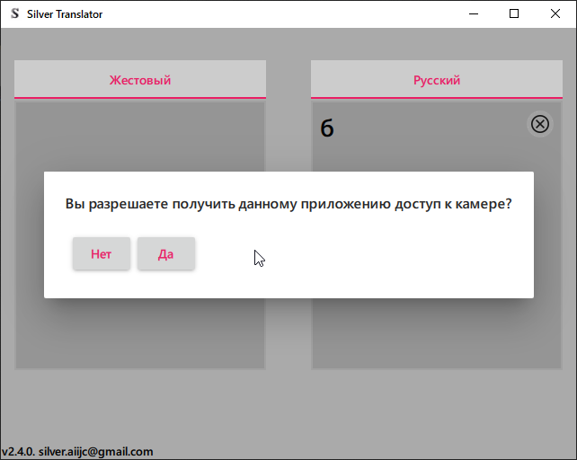
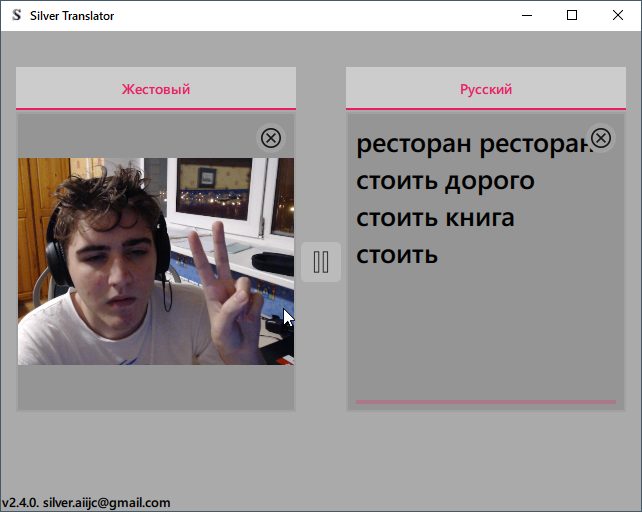

# Silver-qt
Application for Russian Sign Language recognition

## Technologies
PyQT5+QML and ONNX models for inference;

## How to test
From the root of the repository:
```
import predict
predict.predictTree(path_to_folder)
```
As a result you will get a file named "results.csv" with predictions for each file.

## Installation
```
pip3 install -r requirements.txt
```
## Instructions
There are two huge icons on the first screen, first one allows you to upload a video file for translateion, second one stream image from webcamera directly into translation module.



### Process videofiles

When you press on the "Upload file" the file dialog will appear, and the the video will be played in the left area.


Then, if you press the "Arrow" (translate button) the translation process will begin, and after a few seconds you will get a translation on the left side:


->


You could clean the translation area or use differen videofile using small crosses in the top right corner of the areas.

### Processing webcamera stream
When you simply click at the webcamera icon in the left area, the dialog about camera access will appear. 



After answering "Yes" you would see your image from camera moving. To start translation you should press the translation button. Then the programm will automatically detects gestures(or signs) you show, and translate them. Here you could the very likeness of myself in front of webcam showing some random things :)


